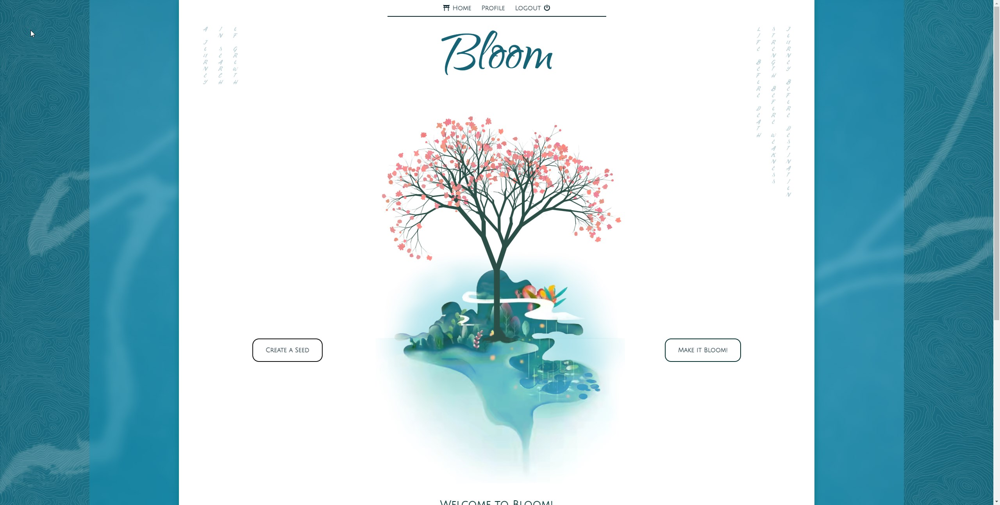
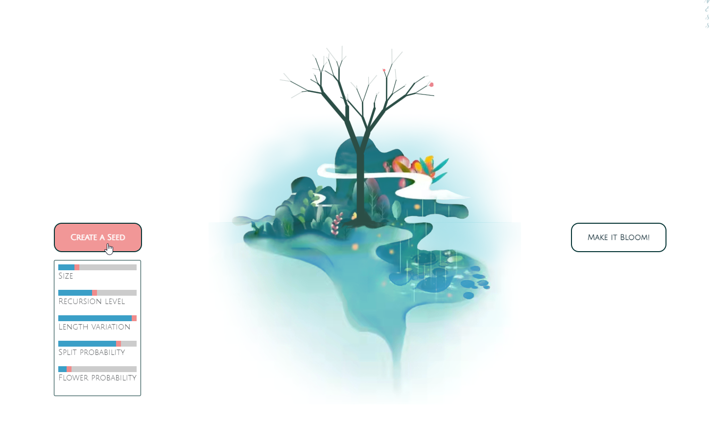
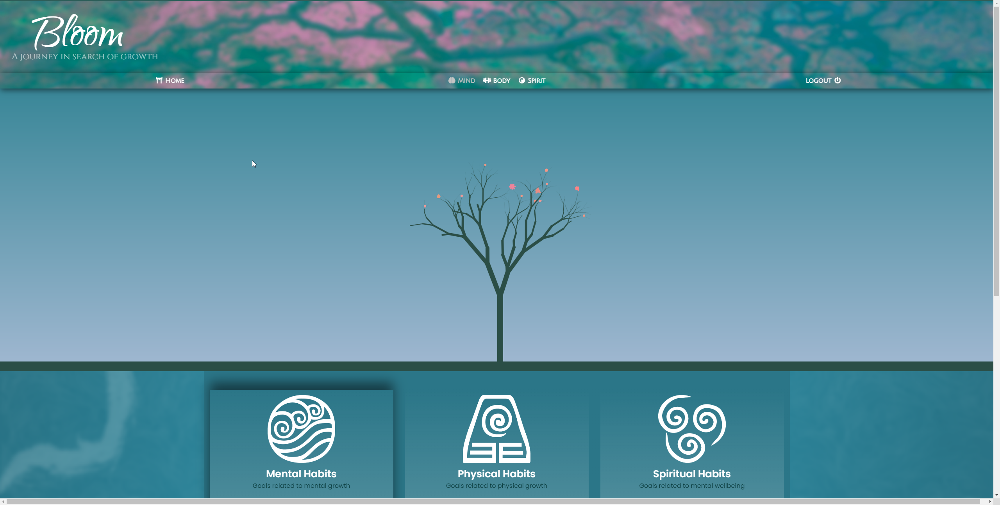
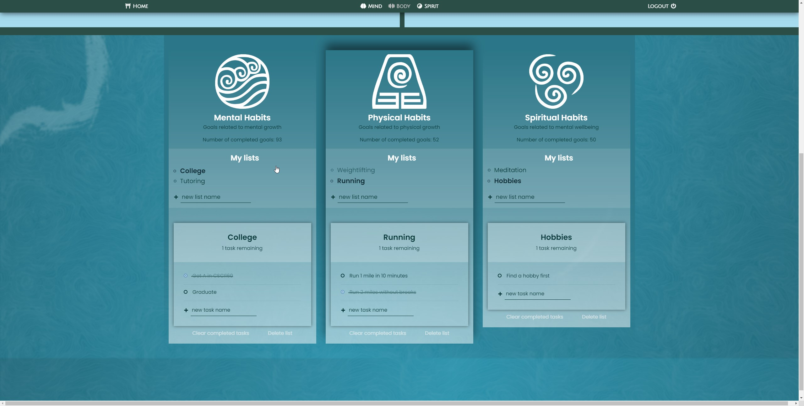

<h1 align='center'>Bloom Proof of Concept  This is an old Bloom test build</h1>

&nbsp;

This is an old proof of concept test build. To see the current Bloom project please visit:

<h3 align='center'> See the live website at: 
<a href="https://bloomhabits.com/">Bloom Website</a>
</h3>

<h3 align='center'> Visit the current Github page: 
<a href="https://github.com/ShhmonDai/Bloom-V2---react-MERN/tree/main">Bloom Github</a>
</h3>
           

&nbsp;

HomePage:
&nbsp;

&nbsp;

On homepage I've decided to add a slight preview of the growth trees to showcase possible visualizations of progress. Here the users can manually play with the variables that make up the trees. On the profile page, each of these variables will be influenced by the number of completed goals for each category to make up the users progress trees. 
&nbsp;

&nbsp;

The main profile page consists of three tabs for the three separate categories of improvement; Mind, Body, Spirit.
&nbsp;

&nbsp;

Here we can see our goal lists. As you can see you can edit each category no matter which category you're currently in but you can only see the tree for the selected category. I've decided on showing only at a time to reduce visual clutter on the main page but an additional side by side view is planned for the future as well.
&nbsp;

<h3 align='center'>Features:</h3> 
&nbsp;
&nbsp;

| Done  | To-Do |
| ------------- | ------------- |
| Dynamic P5.js Tree structure  | Implement mobile view  |
| Bcrypt secured Login / Register  | Integrate the tree growth algorithm into profile pages  |
| JWT authentication  | Add user notes section  |
| MySQL database for users  | Add delete button for unwanted tasks  |
| Local Storage for goals (temp)  | Migrate local storage to the MySQL database  |
| Profile Pages  | Add repeatable habits functionality  |
| Goal lists and goals  | Add deadlines  |
| | Add ability to customize colors  |
| | Professional and modern UI/UX  |

&nbsp;
